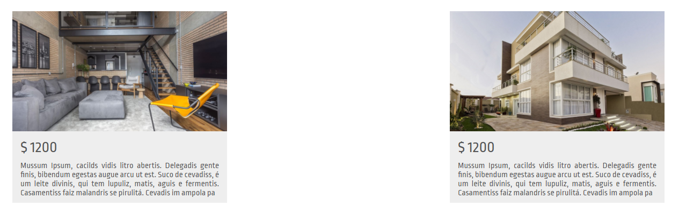
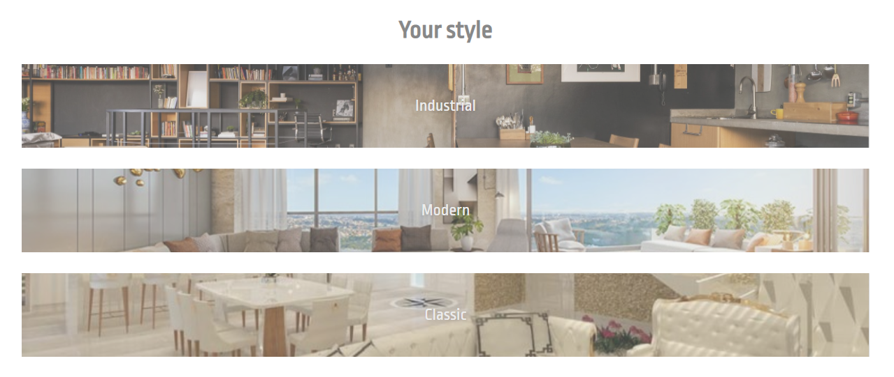
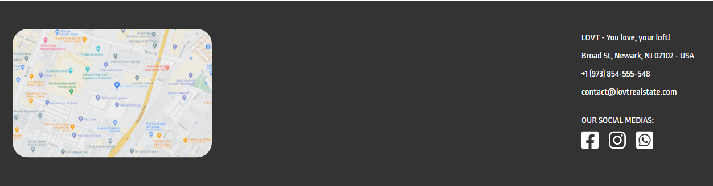

# ELIXR

<!---Esses são exemplos. Veja https://shields.io para outras pessoas ou para personalizar este conjunto de escudos. Você pode querer incluir dependências, status do projeto e informações de licença aqui--->




> Projeto desenvolvido através de uma videoaula.

## 📝 Descrição
Este é um projeto desenvolvido em ReactJS. Utilizado como uma forma de estudar tal tecnologia. 

## 📷 Fotos


> Parte inicial da homepage.


> Área de informações


> Área de informações


> Rodapé do site


## 💻 Pré-requisitos

Antes de começar, verifique se você atendeu aos seguintes requisitos:
<!---Estes são apenas requisitos de exemplo. Adicionar, duplicar ou remover conforme necessário--->
* Você instalou a versão mais recente de `node e npm`
## 🚀 Instalando ELIXR

Para instalar o ELIXR, siga estas etapas:

```
npm install
```

## ☕ Usando ELIXR

Para usar ELIXR, siga estas etapas:

```
yarn start
```

## 🤝 Colaboradores

Agradecemos às seguintes pessoas que contribuíram para este projeto:

<table>
  <tr>
    <td align="center">
      <a href="#">
        <br>
        <sub>
          <b>Kauã Nunes</b>
        </sub>
      </a>
    </td>
  </tr>
</table>


## 📝 Licença

MIT

[⬆ Voltar ao topo](#elixr)<br>